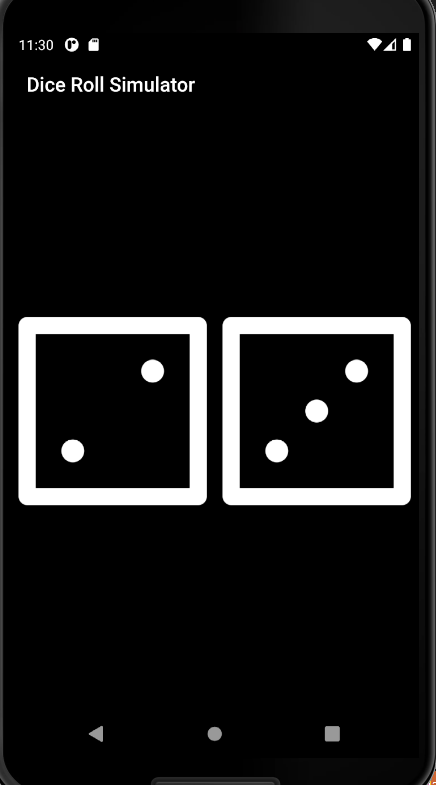

# Dice Roll Simulator

A simple Flutter app that simulates rolling two dice.

## Getting Started

### Prerequisites

- Flutter installed on your machine. For installation instructions, visit [Flutter - Get Started](https://flutter.dev/docs/get-started/install).

### Installation

1. **Clone the repository:**

   ```bash
   git clone https://github.com/Nishanth200/Dice-Roll-App-Flutter.git

2. **Navigate to the project directory:**
    ```bash
   cd Dice-Roll-App-Flutter

3. **Run the app:**
    ```bash
    flutter run

## Features
- Simulates rolling two six-sided dice.
- Displays the result with images of the rolled dice.

## How to Use
- Tap the dice images to roll the dice and see the new result.
## Screenshots



## Contributing
- If you'd like to contribute to this project, feel free to open issues or pull requests.


